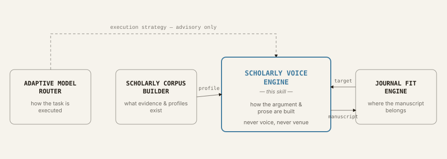

# Scholarly Voice Engine


*Discipline-aware argument architecture and evidence-disciplined voice
synthesis for scholarly writing — not generic AI paraphrasing.*

**Scholarly Voice Engine is a cross-disciplinary Agent Skill for producing
discipline-aware, genre-aware, intellectually structured academic prose.** It
synthesizes transferable scholarly writing patterns from historical
intellectual traditions, modern disciplinary conventions, research-design
constraints, and an author's own established voice to support journal
articles, reviews, commentaries, book chapters, monographs, and
interdisciplinary and multilingual scholarship.

The final output aims to be:

- discipline-appropriate
- intellectually structured
- evidence-aware
- stylistically human
- conceptually precise
- original in voice

rather than simply formal-sounding, verbose, citation-heavy, or "AI-polished."

## Why this exists

Generic AI academic prose tends to collapse "scholarly voice" into formal
vocabulary + long sentences + many citations. Real scholarly voice is about
*how an argument moves*: what claims are made and how strongly, how evidence
sits next to claims, how counterarguments are handled, how concepts are
defined and kept stable, and how paragraphs and sections accumulate
intellectual force. This Skill models scholarly writing at that level,
separately for each discipline, genre, and research design, rather than
applying one universal "academic style."

## How it thinks

Voice is resolved last, not first. Discipline, genre, research design, and
argument architecture are all settled before a single sentence is drafted,
and every draft still passes through integrity guards before it ships.


*Fig. 1 — An author or corpus profile, when available, calibrates voice; a
journal target adapts framing and structure, never substance. Citation-
integrity and claim-calibration guards run before the quality audit decides
whether the draft ships, loops back for repair, or is reported as blocked
rather than shipped anyway. An
[interactive version](https://claude.ai/code/artifact/6a2be627-df15-4be8-be19-e32ad1204e21)
of this figure is also available.*

Full step-by-step detail lives in `SKILL.md` §Operating hierarchy; the guard
rails are `references/citation-integrity.md`, `references/claim-calibration.md`,
and `references/quality-audit.md`.

## What it is not

- Not a celebrity-imitation engine. Historical figures are modeled as
  **abstracted, transferable mechanisms**, never as characteristic phrases or
  quotations to copy.
- Not a direct-imitation tool for living scholars. Requests to "write exactly
  like [living author]" are honored only at the level of abstracted
  high-level traits, synthesized into an original voice.
- Not a model router, corpus builder, or journal recommender. It assumes the
  host or sibling skills (`adaptive-model-router`, `scholarly-corpus-builder`,
  `journal-fit-engine`) own those responsibilities — see
  `references/integration.md`.
- Not an AI-detector-evasion tool. The goal is prose that is genuinely well
  constructed, not prose engineered to fool a classifier.

## Ecosystem integration

Four skills, four non-overlapping jobs — this one owns only how the argument
and prose get built:



*Fig. 2 — The Corpus Builder supplies a profile and the Journal Fit Engine
supplies a compact adaptation target and receives the finished manuscript
back; the Router's execution strategy is advisory only. No sibling ever
decides how this Skill argues or writes.*

This Skill consumes `scholarly-corpus-builder` profiles and
`journal-fit-engine` adaptation targets when those Skills are present, and
degrades gracefully to its own internal discipline/genre defaults when they
are not. See `references/integration.md`,
`references/corpus-profile-integration.md`, and
`references/journal-style-adaptation.md` for the full contracts.

## Repository layout

```text
scholarly-voice-engine/
├── SKILL.md                          # entry point — compact, progressive loading
├── README.md
├── LICENSE
├── CHANGELOG.md
├── VERSION
├── agents/
│   └── openai.yaml                   # optional cross-runtime agent descriptor
├── assets/
│   ├── pipeline-diagram.svg          # Fig. 1 — the drafting pipeline
│   └── ecosystem-diagram.svg         # Fig. 2 — ecosystem position
├── references/
│   ├── voice-engine.md               # voice-dimension schema, composite profiles
│   ├── disciplinary-matrix.md        # discipline routing table
│   ├── genre-matrix.md               # supported genres and their features
│   ├── research-design-matrix.md     # design-driven claim ceilings
│   ├── argument-architectures.md     # section-shape per discipline family
│   ├── claim-calibration.md          # claim types, claim-strength invariant
│   ├── citation-integrity.md         # no-fabrication and citation-preservation rules
│   ├── human-scholarly-prose.md      # anti-generic-AI rules, rhythm
│   ├── quality-audit.md              # integrity tests, quality states, stop rule
│   ├── historical-voice-profiles.md  # abstracted historical scholarly profiles
│   ├── era-calibration.md            # intellectual-era prose calibration
│   ├── author-voice-calibration.md   # inferring/prioritizing the user's own voice
│   ├── corpus-profile-integration.md # consuming a scholarly-corpus-builder profile
│   ├── journal-style-adaptation.md   # consuming a journal-fit-engine target
│   ├── article-writing.md            # article-scale architectures
│   ├── review-writing.md             # narrative/systematic/scoping/meta-analysis reviews
│   ├── commentary-writing.md         # commentary/perspective/editorial
│   ├── book-writing.md               # book/chapter-scale architectures, continuity
│   ├── continuity-ledger.md          # concept/claim/evidence/chapter ledgers
│   ├── multilingual-writing.md       # non-English and translation-mode writing
│   ├── editing-modes.md              # editing intensity and output modes
│   ├── interdisciplinary-writing.md  # combining disciplines without collision
│   └── integration.md                # Router / Corpus Builder / Journal Fit contract
├── disciplines/
│   ├── natural-sciences.md
│   ├── mathematics-formal.md
│   ├── engineering-computing.md
│   ├── medicine-health.md
│   ├── social-sciences.md            # includes an Economics subsection
│   ├── business-management.md
│   ├── law.md
│   ├── humanities.md                 # includes Philosophy and History subsections
│   ├── education.md
│   ├── arts-design.md
│   └── interdisciplinary.md
├── evals/
│   ├── discipline-cases.jsonl
│   ├── genre-cases.jsonl
│   ├── voice-cases.jsonl
│   ├── anti-generic-ai-cases.jsonl
│   ├── book-continuity-cases.jsonl
│   ├── integrity-cases.jsonl
│   └── multilingual-cases.jsonl
├── scripts/
│   ├── validate_skill.py
│   ├── package_runtime.py
│   └── voice/
│       ├── profile_schema.py
│       ├── profile_merge.py
│       ├── continuity.py
│       └── audit.py
└── tests/
    ├── test_validate_skill.py
    ├── test_profile_schema.py
    ├── test_profile_merge.py
    ├── test_continuity.py
    └── test_audit.py
```

## Adding a new discipline

1. Add a row to the routing table in `references/disciplinary-matrix.md`.
2. Add `disciplines/<new-discipline>.md` following the schema at the top of
   any existing discipline file (`discipline_family`, `default_claim_style`,
   `typical_argument_structures`, `typical_evidence`, `citation_behavior`,
   `methods_visibility`, `acceptable_first_person`, `common_failure_modes`,
   `recommended_voice_profiles`, `book_writing_norms`, `article_writing_norms`).
   For a subfield distinctive enough to need its own conventions but not a
   whole new routing family (as with Economics and Philosophy/History), add a
   subsection to the existing family file instead — see those files for the
   pattern.
3. Do not edit `SKILL.md` — it loads discipline files by convention, not by
   an enumerated list that needs updating.
4. Add at least 2–3 eval cases to `evals/discipline-cases.jsonl`.

## Integrity guarantees

- No fabricated citations, quotations, data, or results — ever.
- No deliberately inserted errors to seem "more human."
- No claim-strength inflation (e.g., association reworded as causation).
- No novelty/contribution inflation.
- No direct stylistic imitation of living authors.
- Voice edits never silently change data, results, causal claims, legal
  rules, historical facts, or formal definitions/theorems.

## Validating this Skill

```bash
python scripts/validate_skill.py
```

Checks frontmatter validity, that every reference/discipline file referenced
from `SKILL.md` exists, that eval fixtures are well-formed JSONL, that
`VERSION` matches the latest `CHANGELOG.md` entry, that
`references/integration.md` names all three sibling skills, and flags common
anti-generic-AI violations inside the Skill's own prose (dogfooding).

## Running tests

```bash
python -m unittest discover -s tests
```

Covers `scripts/voice/profile_schema.py`, `profile_merge.py` (including a
deliberate profile-conflict case), `continuity.py` (including a deliberate
contradiction case), `audit.py` (including a clean-text negative case), and
the validator itself.

## Packaging

```bash
python scripts/package_runtime.py
```

Produces `dist/scholarly-voice-engine-<version>.zip` from `VERSION` plus the
runtime files (`SKILL.md`, `README.md`, `LICENSE`, `CHANGELOG.md`, `VERSION`,
`agents/`, `assets/`, `references/`, `disciplines/`, `scripts/`) — `tests/`
and `evals/` are development-only and excluded.

## Known limitations

See `CHANGELOG.md` for the full list — in short: v1.0.0 is English-first
(the multilingual module is architecture-level, not a full per-language
rhetorical rulebook), the historical-profile library is illustrative rather
than exhaustive, discipline modules describe family/subfield-level norms
rather than every journal's house style, and the helper Python modules under
`scripts/voice/` use heuristic rather than NLP-based detection.
